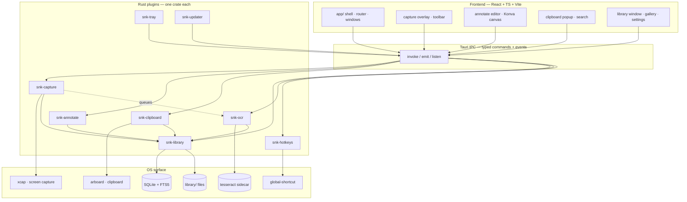
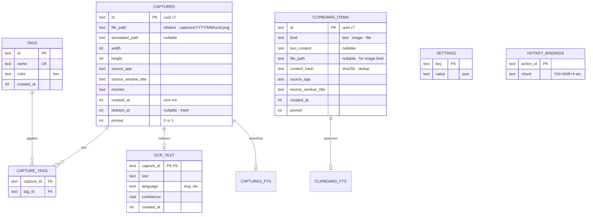
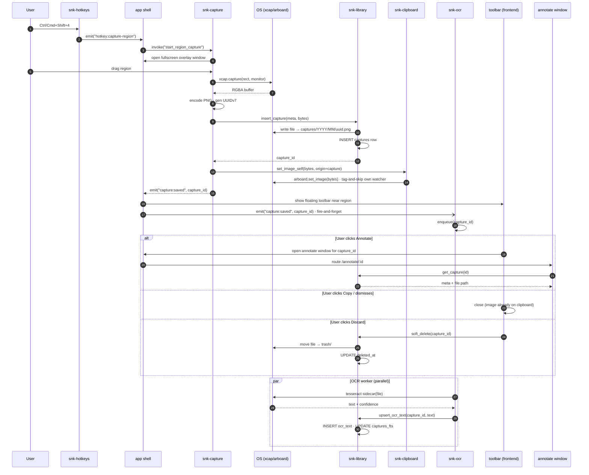
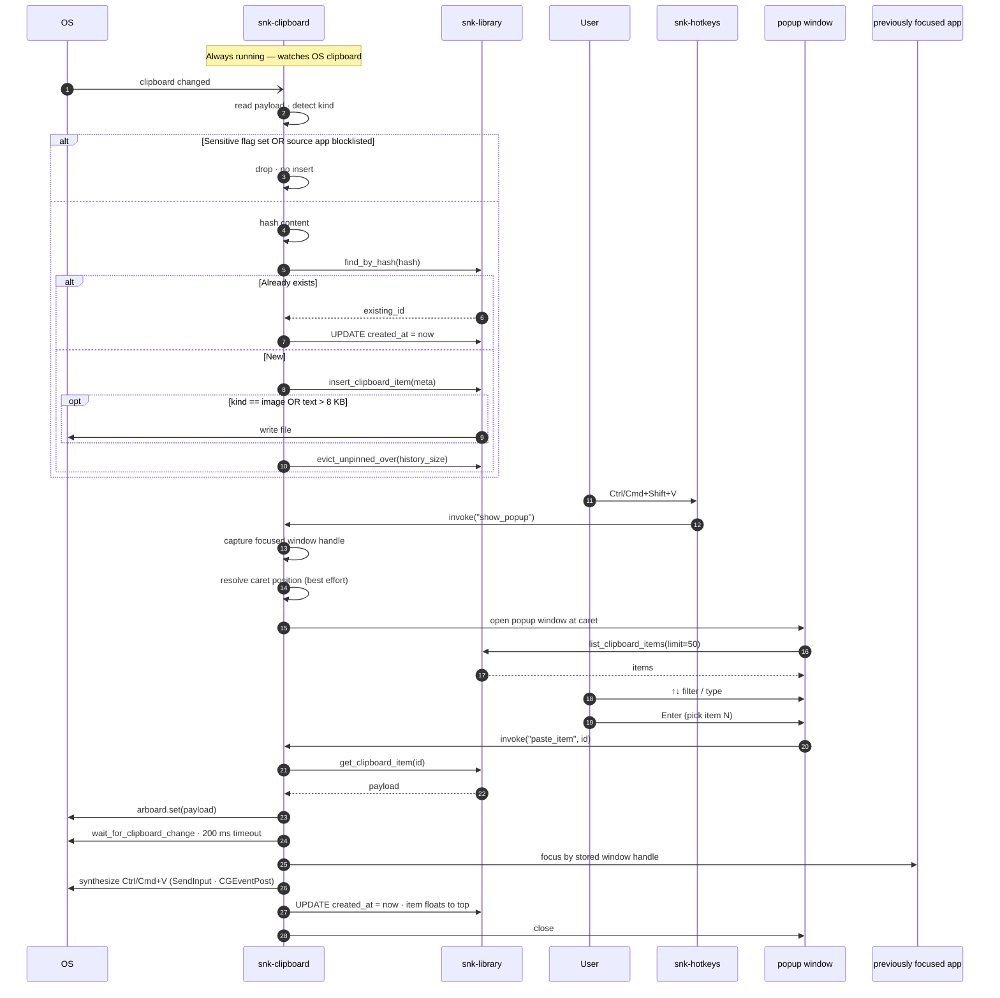
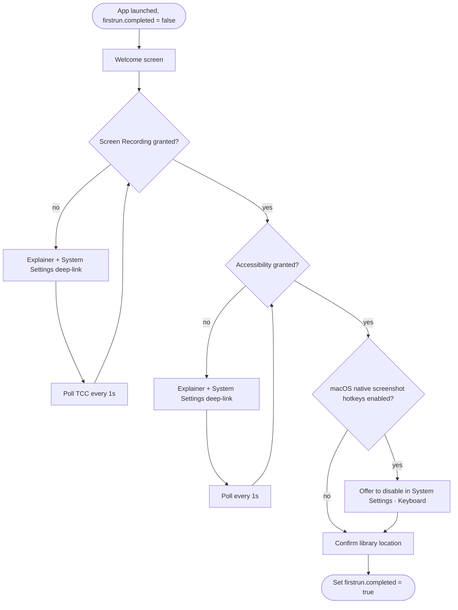
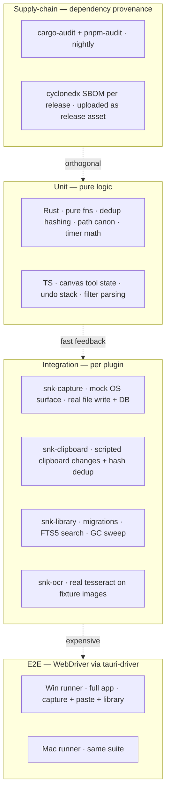

# snapper-keeper · design

**Status:** draft · pending approval
**Date:** 2026-05-20
**Audience:** "share-friendly side project" — signed installers, auto-update, GitHub Releases, no store distribution, no servers.

## 1. Summary

`snapper-keeper` is a cross-platform (Windows + macOS) desktop utility that combines:

1. **Screen capture** with organized history, OCR-indexed search, and lightweight annotation.
2. **Clipboard management** with a caret-anchored history popup, sensitive-content filtering, and auto-paste into the previously-focused app.

The two features ship in one app, share a tray icon and a single library on disk, and are organized as separate Tauri plugins so they remain operationally distinct.

## 2. Goals & non-goals

### Goals (v1)

- Capture region, active window, full screen, timed (delayed) capture across multi-monitor setups
- Annotation: arrow, rectangle, ellipse, freehand pen, highlighter, text, blur/pixelate, crop, numbered step markers, undo/redo
- OCR on captures (async, background) — text indexed and searchable
- Clipboard history (text, images, files), 200-item cap, pinning, sensitive-flag and per-app blocklist filtering
- Caret-anchored clipboard popup with arrow-key + number-key navigation, type-to-filter, auto-paste on Enter
- Library window with sidebar (smart sections + tags + clipboard) and gallery view
- Tags-based organization, no folders
- Signed, notarized installers via GitHub Actions; Tauri auto-updater with Ed25519-signed manifests
- First-run wizard handling macOS permissions and hotkey conflicts
- Zero telemetry, zero accounts, zero servers

### Non-goals (v1)

- Scrolling capture (deferred — divergent per-OS implementation cost)
- Video / GIF recording
- Cloud sync (defer to a hypothetical v2; users can point the library at iCloud/Dropbox/OneDrive themselves if they want sync now, but this is unsupported)
- Speech bubbles, spotlight/dim, magnifier loupe, rotate in the annotator
- Crash report uploads (logs are local-only)
- App Store / Microsoft Store distribution
- License gating or paid tiers

## 3. Stack & top-level decisions

| Decision | Choice | Why |
|---|---|---|
| Framework | Tauri 2 | Small footprint for an always-on tray app (~30–80 MB resident vs Electron's 150–300 MB); Rust plugin isolation for OS integration; web frontend matches author's strengths |
| Frontend | React + TypeScript + Vite | Mainstream, mature, fits component composition for multiple windows |
| Styling | Tailwind + shadcn/ui | Design-system primitives without lock-in; matches the dark-utility aesthetic |
| State (frontend) | Zustand + TanStack Query | Zustand for app/UI state, Query for async reads from `snk-library` |
| Routing | TanStack Router | Multi-window app benefits from typed routes per window |
| Canvas | Konva | Vector annotation, undo-friendly, mature |
| Persistence | SQLite (rusqlite) with FTS5 | Single embedded store, sub-ms search, no extra runtime |
| Migrations | refinery (or rusqlite_migration) | Versioned forward migrations, embedded at build time |
| OS APIs | xcap (capture), arboard (clipboard), tauri-plugin-global-shortcut (hotkeys), tesseract sidecar (OCR) | All cross-platform, all mature |
| Distribution | GitHub Releases | Free, signed artifacts; updater manifest hosted there |
| Updates | tauri-plugin-updater with Ed25519 manifest signatures | Code signing protects install; update signature protects upgrade path |
| Telemetry | None | Privacy posture for audience B; removes infra surface |
| Code organization | One Tauri plugin per feature (one crate each) | Enforces boundaries; matches the project's stated quality bar; future-friendly for open-sourcing individual plugins |

## 4. Architecture

### 4.1 System layout



### 4.2 Plugin set

| Plugin | Owns | Depends on |
|---|---|---|
| `snk-capture` | Region selector overlay, window/full-screen capture, timed capture, file write | `snk-library`; emits event to `snk-ocr` |
| `snk-annotate` | Canvas state model, tool commands, undo stack, export | `snk-library` |
| `snk-clipboard` | Clipboard watcher, dedup, sensitive-flag filter, popup, paste synthesis | `snk-library` |
| `snk-library` | SQLite migrations + FTS5 index, tag management, file IO, query API | — (foundation) |
| `snk-ocr` | Async OCR queue, tesseract sidecar process, text indexing | `snk-library` |
| `snk-hotkeys` | Register / remap / detect conflicts; thin wrapper over `tauri-plugin-global-shortcut` | — |
| `snk-tray` | Tray icon, menu, OS-specific behavior | — |
| `snk-updater` | Update check, download, restart prompt; wraps `tauri-plugin-updater` | — |

### 4.3 Frontend structure

```
app/
  src/
    main.tsx              entry, providers, theme
    router.tsx            TanStack Router · routes per window
    windows/
      library/            library window (sidebar + grid)
      annotate/           annotate window (opens per-image)
      clipboard-popup/    popup window (Ctrl/Cmd+Shift+V)
      capture-overlay/    fullscreen overlay for region select
      settings/           settings window
    shell/
      tray-menu/          (wires snk-tray)
      providers/          query client, hotkey context, theme
packages/
  snk-capture/   src/{commands.ts, events.ts, hooks.ts, types.ts}
  snk-annotate/  src/{canvas/, tools/, hooks.ts, types.ts}
  snk-clipboard/ src/{commands.ts, events.ts, hooks.ts, types.ts}
  snk-library/   src/{queries.ts, mutations.ts, schema.ts}
  snk-ocr/       src/{commands.ts, events.ts, types.ts}
```

Each Rust plugin ships a paired TypeScript package exporting typed bindings + hooks. The `app/` shell composes them; plugin TS packages know nothing about each other.

### 4.4 Dependency rules

1. **All persistence flows through `snk-library`.** No plugin reads or writes another plugin's tables directly. `snk-library` exposes a typed query/mutation API; everything else is a consumer.
2. **No plugin imports another plugin's internals.** Cross-plugin communication is Tauri commands or events. Forced separation prevents shared-state creep.
3. **OCR is fire-and-forget.** `snk-capture` emits `capture:saved` with the capture id. `snk-ocr` subscribes and processes asynchronously. Capture never waits on OCR.
4. **Windows are frontend-only.** Plugins are pure Rust contracts. The annotate window and clipboard popup are frontend artifacts that compose plugin bindings; plugins don't own window lifecycle.
5. **`snk-clipboard` skips its own writes.** When `snk-capture` auto-copies, the call routes through `snk-clipboard` so the watcher can tag-and-skip rather than dedup against itself.

## 5. Data model

### 5.1 Entity-relationship



### 5.2 Full-text search (FTS5)

```sql
CREATE VIRTUAL TABLE captures_fts USING fts5(
  capture_id UNINDEXED,
  source_app,
  window_title,
  ocr_text,
  tag_names,
  content=''           -- contentless · we own population
);

CREATE VIRTUAL TABLE clipboard_fts USING fts5(
  clipboard_id UNINDEXED,
  text_content,
  source_app,
  window_title
);
```

Contentless FTS5 — `snk-library` populates and updates rows explicitly inside the same transaction that mutates the base table. Search hits return ids, which we then join.

### 5.3 Dedup behavior

- **Text:** SHA-256 of normalized content (trim + collapse internal whitespace). On duplicate, update existing row's `created_at` (re-sorts to top). No insert.
- **Image clipboard:** SHA-256 of raw pixel bytes. Same dedup. Image file is reused.
- **File clipboard:** hash of canonicalized path string.
- **Pinned items are never evicted.** History cap applies only to `pinned = 0`.
- **Sensitive items are dropped at the watcher** — never inserted, never on disk.

### 5.4 File layout on disk

```
<library>/                                     fixed location · OS-specific app data dir
  snapper-keeper.db                            SQLite · WAL mode
  snapper-keeper.db-wal · -shm                 WAL companions
  captures/2026/05/01H...png                   originals
  captures/2026/05/01H...annotated.png         annotated variant (when saved)
  clipboard/2026/05/01H...png                  clipboard images
  clipboard/text/01H....txt                    text blobs > 8 KB (else inline in DB)
  thumbs/                                      256 px JPEG thumbnails · regenerable
  trash/                                       soft-deleted files (30-day retention)
  logs/                                        app + crash logs
  backups/                                     pre-migration DB snapshots
  cache/                                       transient state · safe to delete
```

Fixed locations:
- macOS: `~/Library/Application Support/snapper-keeper/`
- Windows: `%APPDATA%/snapper-keeper/`

### 5.5 Settings keys

```
library.path             string  (read-only after install)
clipboard.history_size   int     default 200
clipboard.track_images   bool    default true
clipboard.track_files    bool    default true
clipboard.app_blocklist  string[] default [common password managers]
capture.format           enum    png/jpg/webp · default png
capture.auto_copy        bool    default true
capture.jpg_quality      int     default 90 (when format=jpg)
ocr.enabled              bool    default true
ocr.languages            string[] default [eng]
updater.channel          enum    stable
firstrun.completed       bool    default false
hotkeys.<action_id>      string  chord
```

### 5.6 Migrations

`refinery`-style with `migrations/V001__initial.sql`, `V002__...sql` embedded at build time. Forward-only. Each migration runs inside a transaction; auto-rollback on failure. Pre-migration DB snapshot written to `backups/snapper-keeper-<from_version>.db` so a botched migration is recoverable by file copy.

The app refuses to start if the on-disk DB version exceeds the version the binary supports (forward-compat guard against downgrades).

### 5.7 Garbage collection

- **Trashed captures:** hard-deleted after 30 days (configurable). File moved to `trash/`, then unlinked.
- **Clipboard items:** evicted when `pinned=0` count exceeds `clipboard.history_size`. Files unlinked atomically with row delete.
- **Orphaned files:** weekly sweep — any file under `captures/` or `clipboard/` with no DB row is logged then deleted.
- **Thumbnails:** regenerated on demand. `thumbs/` deletable any time.

## 6. Key flows

### 6.1 Capture



Post-capture floating toolbar: Annotate · Copy · Save · Discard. "Save" closes the toolbar (already saved to library). "Copy" closes (already on clipboard). "Annotate" opens the annotate window for that capture id. "Discard" soft-deletes.

### 6.2 Clipboard



### 6.3 Caret position fallback

Caret position is best-effort; many cross-platform UIs don't expose it. Fallback chain:

1. **Win:** `GetGUIThreadInfo` + `GetCaretPos` in the focused window's thread.
2. **Mac:** `AXUIElement` → `kAXFocusedUIElementAttribute` → `kAXPositionAttribute`.
3. If unavailable: **cursor position**.
4. If popup would clip off-screen: nudge inward, stay within active monitor bounds.

### 6.4 Auto-paste failure modes

| Failure | Handling |
|---|---|
| macOS Accessibility not granted | First attempt prompts; popup remembers the focused app and offers "retry after granting" |
| Target app refocus race | Store window handle *before* popup gains focus; refocus by handle, not by title/AppleScript |
| Clipboard set didn't take | 200 ms timeout on change event; drop item back into popup with error toast |
| App blocks synthetic input (rare) | Paste-only fallback — sets clipboard, doesn't synthesize Ctrl/Cmd+V, one-time hint surfaced |

## 7. UI

### 7.1 Tray menu

```
📷 Capture region       Ctrl/Cmd+Shift+4
🪟 Capture window       Ctrl/Cmd+Shift+5
🖥 Capture screen       Ctrl/Cmd+Shift+3
⏱ Timed (5s)            Ctrl/Cmd+Shift+6
─────────────────────────────────────────
📋 Clipboard history    Ctrl/Cmd+Shift+V
─────────────────────────────────────────
📚 Open library
⚙ Settings…
Quit
```

Tray-only by default (no dock icon on macOS, no taskbar entry on Windows). Library / settings / annotate windows are opened on demand.

### 7.2 Library window

- **Sidebar:** Smart sections (All, Today, This Week, Pinned, Trash) · Tags list · Clipboard History entry
- **Main:** Search bar (filename + tags + source app + OCR text) · Sort · "+ Capture" button · Gallery grid (4 columns at standard width, responsive)
- Single window. Closing returns to tray.

### 7.3 Annotate editor

Tools (left rail): arrow · rectangle · ellipse · freehand pen · highlighter · text · blur/pixelate · numbered step markers · crop. Color palette (6–8 swatches + custom). Three stroke widths. Undo/redo. Save (overwrites or creates `.annotated.png` variant) / Copy / Done.

### 7.4 Clipboard popup

- Appears at caret position (cursor fallback), 380 px wide.
- Search input at top (type-to-filter, no click required).
- List with type icons (T/image/file), preview, source app, time ago.
- Number-key shortcuts (1–9) for top items.
- Pinned items pinned to top with 📌 indicator.
- Footer key hints: ↑↓ nav · Enter paste · 1–9 jump · ⌘P pin · Esc close.

### 7.5 Default hotkeys

| Action | Win | Mac |
|---|---|---|
| Capture region | `Ctrl+Shift+4` | `Cmd+Shift+4` |
| Capture window | `Ctrl+Shift+5` | `Cmd+Shift+5` |
| Capture full screen | `Ctrl+Shift+3` | `Cmd+Shift+3` |
| Timed capture (5 s) | `Ctrl+Shift+6` | `Cmd+Shift+6` |
| Clipboard history | `Ctrl+Shift+V` | `Cmd+Shift+V` |
| Open library | `Ctrl+Shift+L` | `Cmd+Shift+L` |

All remappable in Settings. Live conflict detection at bind time.

## 8. OS integration & security

### 8.1 Permissions matrix

| Capability | macOS | Windows |
|---|---|---|
| Screen capture | Screen Recording (TCC) — prompted on first capture | None |
| Synthetic input (auto-paste) | Accessibility (TCC) — prompted on first paste | None (`SendInput`) |
| Global hotkeys | None (`NSEvent` global monitor) | None (`RegisterHotKey`) |
| Caret position lookup | Accessibility (shares grant with auto-paste) | None |
| Tray icon | None | None |
| Library directory | None (app's own data dir) | None |
| Auto-launch at login | `SMAppService` | Registry `HKCU\...\Run` |

### 8.2 First-run wizard (macOS)



Windows wizard is a subset (no permission steps; jump straight to hotkey/library confirmation).

### 8.3 Tauri capabilities

Capability files scope which windows can invoke which plugins. The clipboard popup window only has access to `snk-library:read` and `snk-clipboard:paste` — it cannot mutate captures, run OCR, or change hotkeys. Privilege isolation is enforced by the framework, not by frontend convention.

```jsonc
// app/capabilities/default.json
{
  "identifier": "default",
  "windows": ["library", "settings"],
  "permissions": [
    "core:default",
    "snk-library:default",
    "snk-capture:default",
    "snk-annotate:default",
    "snk-clipboard:default",
    "snk-hotkeys:read"
  ]
}

// app/capabilities/clipboard-popup.json
{
  "identifier": "clipboard-popup",
  "windows": ["clipboard-popup"],
  "permissions": [
    "snk-library:read",
    "snk-clipboard:paste"
  ]
}
```

### 8.4 Sensitive-clipboard detection

**macOS** — drop if pasteboard contains any of:

- `org.nspasteboard.ConcealedType`
- `org.nspasteboard.TransientType`
- `org.nspasteboard.AutoGeneratedType`

**Windows** — drop if clipboard contains:

- Format `CFSTR_EXCLUDECLIPBOARDCONTENTFROMMONITORING`
- Format `"CanIncludeInClipboardHistory"` = 0
- Format `"CanUploadToCloudClipboard"` = 0 (advisory)

Filtering happens at the watcher — sensitive content is never persisted.

**Implementation status (post-2026-05-24):** wired in [`docs/superpowers/specs/2026-05-24-sensitive-clipboard-design.md`](2026-05-24-sensitive-clipboard-design.md). The schema column originally proposed (`sensitive INTEGER`) was dropped in V005 because content is filtered at the watcher and the column never becomes load-bearing.

### 8.5 Signing & notarization

| Target | Cert | Annual cost | Pipeline |
|---|---|---|---|
| macOS | Apple Developer ID + `notarytool` notarization + staple | $99 (Apple Developer Program) | GitHub Actions on tag · `macos-latest` |
| Windows | Standard code-signing cert (DigiCert / SSL.com / Certum); EV optional later | $70–200 standard, $300+ EV | GitHub Actions · `azuresigntool` or `signtool` |

Update payloads carry a separate Ed25519 signature (Tauri updater convention) verified before any install. Even if GitHub Releases is compromised, the user can't be tricked into installing an unsigned binary. Private key stays in GitHub Actions secrets.

### 8.6 Hotkey conflict detection

- **At bind time:** registration call returns "already in use" on conflict; surface in UI before saving.
- **macOS system shortcuts:** read `~/Library/Preferences/com.apple.symbolichotkeys.plist` at first run to detect 3/4/5 conflicts and offer to disable.
- **Cross-app conflicts:** not detectable by inspection — surface gracefully on registration failure ("Couldn't register {chord} — another app may have it. Try a different chord?").

## 9. Error handling

### 9.1 Error classes

| Class | Examples | Policy |
|---|---|---|
| Permission denied | Screen Recording / Accessibility not granted | In-app banner with deep-link · feature gated until granted |
| Recoverable user-facing | Hotkey conflict · target app dropped focus · capture cancelled | Toast with action ("Choose a different chord", "Retry"). No modal dialogs. |
| Recoverable internal | Sidecar (tesseract) crashed · transient DB lock | Retry with backoff (3 attempts) · log · surface only on final failure |
| Data integrity | File missing but DB row exists · row exists, file orphaned | Lazy heal — placeholder thumbnail · weekly sweep reconciles · log |
| Migration failure | SQLite migration fails mid-way | Auto-rollback (transaction) · pre-migration snapshot in `backups/` · block start with explainer + restore option |
| Updater | Download failed · signature mismatch | Silent retry on next check · signature mismatch logged, never auto-applied |
| Unrecoverable / panic | Rust panic, OOM | Catch at panic hook · crash dump to `logs/crash-<ts>.json` · restart prompt · v1 has no upload |

### 9.2 AppError contract

```rust
#[derive(Serialize, Debug)]
#[serde(tag = "kind", rename_all = "kebab-case")]
pub enum AppError {
    PermissionDenied { which: Permission, deep_link: String },
    HotkeyConflict   { chord: String, suggestion: Option<String> },
    CaptureCancelled,
    TargetLostFocus,
    ClipboardSetTimeout,
    Sidecar          { tool: String, exit: i32, stderr: String },
    Database         { code: String, retryable: bool },
    Io               { path: String, kind: String },
    Migration        { from: u32, to: u32, recoverable: bool },
    Updater          { stage: UpdaterStage, detail: String },
    Internal         { id: String }, // opaque · log has details
}
```

Every Tauri command returns `Result<T, AppError>`. Frontend pattern-matches on `kind`; no string parsing.

### 9.3 Logging

- **Rust:** `tracing` with file appender → `library/logs/snapper-keeper.log` · daily rotate · 14-day retention.
- **Frontend:** logs via Tauri command into the same file (single source of truth).
- **Levels:** ERROR + WARN always written · INFO in dev · DEBUG behind `SNK_LOG=debug`.
- **No PII:** never log clipboard text content; never log OCR text. Lengths, kinds, source app names yes.
- **Settings → Open log folder** for support.

## 10. Testing

### 10.1 Pyramid



### 10.2 What each layer covers

- **Unit (~70%):** pure logic. Dedup hashing, undo/redo state, filter parser, settings serialization, path canonicalization. Runs in <5 s; runs on every save.
- **Integration (~25%):** each plugin in isolation with real DB + temp filesystem + mocked OS surface trait. Migrations tested forward (and rollback where possible). FTS5 search against fixture data. OCR runs the real tesseract sidecar against a small image fixture set.
- **E2E (~5%):** `tauri-driver` + WebDriver against a real built binary on each OS. Smoke tests: hotkey → capture → save → library shows it; clipboard popup → pick → pasted into target window. Runs on PRs + nightly. Gates releases.
- **Supply-chain (orthogonal, nightly + per-release):** `cargo audit` and `pnpm audit` run nightly; new advisories open an issue. Every release uploads a CycloneDX SBOM as a release asset (`sbom.cdx.json`). This layer is orthogonal to the test pyramid — it doesn't exercise our code, it audits the third-party code we depend on.

### 10.3 Explicit non-goals (testing)

Real OS permission prompts, pixel-perfect annotation rendering, multi-monitor layout edge cases, third-party-app clipboard quirks. Documented as a **manual release checklist** rather than pretending automation can catch them.

### 10.4 CI matrix

- **PR:** lint (clippy + eslint) · unit + integration on `ubuntu-latest` · build verification on `macos-latest` + `windows-latest`.
- **Main:** full E2E on `macos-latest` + `windows-latest`.
- **Tag `v*`:** build · sign · notarize (macOS) · upload artifacts · publish GitHub Release · regenerate `latest.json`.
- **Nightly:** full E2E + `cargo audit` + `npm audit`.

### 10.5 Manual release checklist

- Fresh install · first-run wizard · permission grant flow (Mac)
- Capture region · window · screen · timed
- Annotate · all tools · undo · save
- Clipboard popup against VS Code, browser address bar, Slack, Terminal, Word/Pages
- Multi-monitor: capture per monitor · correct DPI
- Sensitive clipboard: 1Password copy → not in history
- Update flow: install old build · check for update · apply · relaunch
- Sanity check: log folder contains no clipboard / OCR text

## 11. Distribution

- **Channels:** stable only for v1. Beta channel deferred until there's something useful to dogfood.
- **Update cadence:** updater checks on launch and every 24 h while running. User clicks "Restart to update" — never auto-applied.
- **Cross-architecture:** macOS universal binary (`aarch64` + `x86_64`); Windows `x86_64` only for v1 (`aarch64-pc-windows-msvc` deferred unless requested).
- **Uninstall:** standard OS uninstaller; offer to delete library directory or leave it for reinstall.

## 12. Open questions / future work

These were considered and explicitly deferred:

- **Scrolling capture** — meaningful per-OS implementation cost; defer until user signal.
- **Video / GIF capture** — significant scope addition (FFmpeg sidecar, encoding, file size); defer.
- **Cloud sync** — defer to hypothetical v2 with a real backend. Pointing the library at iCloud/Dropbox is technically possible but unsupported in v1 (SQLite + cloud sync can corrupt under concurrent writes).
- **Crash report uploads** — privacy posture says no for v1; Sentry self-hosted is the natural add later.
- **macOS Vision OCR** — better than Tesseract on Mac but adds platform-specific code. v1.1 enhancement.
- **App Store / Microsoft Store distribution** — not in audience B scope.
- **Linux support** — out of v1 scope. Tauri supports it; the plugin contracts would compile; tesseract sidecar packaging would need work. Defer.
- **Plugin/extensibility API for end users** — interesting but out of scope.
- **EV code-signing cert (Windows)** — bypass SmartScreen ramp-up; defer based on real install friction.
- **Synced clipboard between devices** — out of scope; covered by "no cloud sync".

## 13. Decisions log

| # | Decision | Why |
|---|---|---|
| 1 | Tauri over Electron / .NET | Resource footprint for an always-on tray app; Rust isolation at OS boundary; web frontend matches author's skills |
| 2 | Audience "B" (share-friendly side project) | Sets the polish/infra bar: signed installers + auto-update yes; servers + accounts no |
| 3 | Capture modes 1/2/3/5/8 (region/window/full/timed/OCR) | Practical core; scrolling and video are scope creep |
| 4 | Auto-paste on Enter (vs clipboard-only) | One-keystroke flow is the whole point; accessibility prompt is normal for this category |
| 5 | Floating toolbar after capture (vs silent or always-annotate) | Fastest "just copy" + annotation one click away |
| 6 | Numbered step markers in v1 annotation tools | Snagit's killer feature, cheap to build, broadly useful |
| 7 | Tags only, no folders | Multi-tag flexibility; folders enforce a single home |
| 8 | Fixed library location (vs user-pointable) | Simpler; cloud sync is explicitly out of scope |
| 9 | Defer cloud sync | No servers for audience B; SQLite + cloud-folder sync corrupts under concurrent writes |
| 10 | Take over `Cmd+Shift+3/4/5` on macOS with first-run guidance | Muscle memory carries; snapper-keeper *is* the better tool |
| 11 | Tesseract sidecar for OCR; async on capture | Cross-platform, no native deps; UI never blocked |
| 12 | Default PNG output; JPG/WebP configurable | Lossless default matches expectations |
| 13 | Zero telemetry / no crash uploads in v1 | Privacy posture; removes infra surface; Sentry self-hosted is the future add |
| 14 | Tauri plugin per feature (vs feature-folder monolith) | Boundary enforcement matches stated quality bar; future-proof for open-sourcing plugins |
| 15 | All persistence through `snk-library` | Single data owner; prevents shared-state drift |
| 16 | Auto-copy on capture routes through `snk-clipboard` | Avoids watcher self-dedup loops |
| 17 | Caret-anchored popup with cursor fallback | Best of both — precision where possible, sane fallback elsewhere |
| 18 | Contentless FTS5 with explicit population | Full control over what gets indexed and when |
| 19 | Forward-only migrations with pre-migration snapshot | Recovery via file copy is more reliable than rollback DDL |
| 20 | Typed `AppError` enum over IPC | Stable error UX, no string parsing, ready for i18n |
